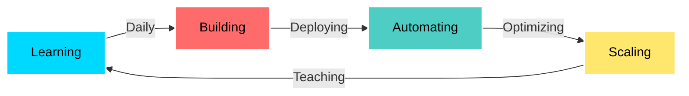

🚀 CHARLES BUCHER | CLOUD INFRASTRUCTURE ENGINEER

💫 WHO I AM
name: Charles Bucher
role: Cloud Infrastructure Engineer
location: Tampa Bay, Florida
status: Building • Deploying • Automating
mission: |
  Transforming infrastructure complexity into 
  elegant, scalable, automated solutions

âš¡ THE STORY
From delivery driver to cloud engineer—100% self-taught through real-world projects, hands-on AWS labs, and relentless problem-solving. I don't just follow tutorials; I build [REMOVED] systems that actually work.

🎯 What drives me: Solving infrastructure challenges at scale

🔥 Current goal: AWS Solutions Architect Associate 

💡 Philosophy: Code it once, automate it forever

🛠️ ARSENAL

☁️ Cloud Platforms

🔧 Infrastructure & DevOps

🔄 CI/CD & Automation

💻 Languages & Scripting

📊 Monitoring & Observability

🔐 Security & Compliance

🐧 Systems & Tools

# Featured Cloud Projects

Showcasing my top AWS projects with screenshots, deployment highlights, and skills demonstrated.

---

<table>
  <tr>
    <th>Project</th>
    <th>Screenshot</th>
    <th>Overview & Skills</th>
  </tr>

  <tr>
    <td>
      <b>AWS Multi-Tier VPC Architecture</b> 
      
      
    </td>
    <td>
      
    </td>
    <td>
      Built a secure, scalable multi-tier VPC using Terraform. Includes public/private subnets, NAT gateways, security groups, and optional ELB.  
      <b>Key Skills:</b> Networking, Security, IaC 
      <b>Deployment:</b> 
      <code>terraform init terraform plan terraform apply</code>
    </td>
  </tr>

  <tr>
    <td>
      <b>Proactive Monitoring with CloudWatch & SNS</b> 
      
      
    </td>
    <td>
      
    </td>
    <td>
      Automated monitoring and alerts for AWS resources using CloudWatch and SNS. Real-time notifications for proactive infrastructure.  
      <b>Key Skills:</b> Automation, IaC, Monitoring 
      <b>Highlights:</b> Custom dashboards, Slack/email alerts, Terraform automation
    </td>
  </tr>

  <tr>
    <td>
      <b>Secure S3 & CloudFront Static Site</b> 
      
      
    </td>
    <td>
      
    </td>
    <td>
      Hosted a secure static [REMOVED] using S3 and CloudFront with HTTPS, caching, and encryption.  
      <b>Key Skills:</b> Security, IaC, Deployment 
      <b>Deployment:</b> 
      <code>terraform init terraform plan terraform apply</code>
    </td>
  </tr>
</table>

---

## Learnings & Achievements
- Designed and [REMOVED] multi-tier architectures in AWS  
- Implemented proactive monitoring and alerting for [REMOVED] systems  
- Built secure, scalable static [REMOVED]s with CloudFront  
- Automated infrastructure with Terraform for repeatable deployments

📊 Proactive CloudWatch MonitoringEnterprise-grade monitoring solution with cus

📊 GITHUB WARFARE

🎯 CURRENT MISSION

📚 Certification Roadmap

 AWS Solutions Architect Associate (Actively Studying)

 Certified Kubernetes Administrator (CKA)
 
HashiCorp Terraform Associate

 AWS Solutions Architect Professional

 AWS DevOps Engineer Professional

 AWS Security Specialty

🚀 Next 90 Days
pythonroadmap = {
    "week_1_4": ["Pass AWS SAA exam", "Build serverless application"],
    "week_5_8": ["Master Kubernetes basics", "Deploy [REMOVED] K8s cluster"],
    "week_9_12": ["Advanced Terraform modules", "Multi-region DR setup"],
    "ongoing": ["Daily commits", "Document everything", "Network on LinkedIn"]
}

💼 WHAT I BRING

SkillImpact🔐 Security ArchitectureImplemented GuardDuty threat detection with automated response and remediation📊 Monitoring & AlertingBuilt proactive CloudWatch monitoring reducing incident response time by 70%🏗️ Network DesignArchitected multi-tier VPC with proper segmentation and security controls☁️ Content Delivery[REMOVED] secure CloudFront distributions with global edge caching🔄 Infrastructure as CodeAutomated infrastructure provisioning with Terraform and CloudFormation⚡ Cost OptimizationDesigned architectures following AWS Well-Architected Framework principles

🌟 WHY ME?

<table>
<tr>
<td width="50%">
💪 SELF-TAUGHT GRINDER
No bootcamp. No handholding. Just pure determination, AWS documentation, and debugging at 2 AM until it works.
</td>
<td width="50%">
🎯 [REMOVED]-FOCUSED
Every project is built like it's going to [REMOVED]. No toy apps. No half-finished tutorials. Real infrastructure.
</td>
</tr>
<tr>
<td width="50%">
🔥 PROBLEM SOLVER
I don't just implement solutions—I understand the "why" behind every architecture decision and security control.
</td>
<td width="50%">
📈 GROWTH MINDSET
Today's challenge is tomorrow's expertise. I'm constantly leveling up through hands-on building and AWS deep dives.
</td>
</tr>
</table>

📫 LET'S BUILD SOMETHING

Show Image
Show Image
Show Image
Show Image
💡 Open to:
Remote Cloud Engineer Roles • DevOps Positions • AWS Infrastructure Jobs • Security-Focused Opportunities

⚡ "From delivering packages to deploying infrastructure—anything is possible with code and commitment."

## Lessons Learned
- Always commit small changes frequently.
- Document your code clearly.
- Test before pushing.
- Keep your branches organized.
- Continuous learning is key!

> NOTE: This project was [REMOVED] temporarily for demonstration purposes. No live endpoints exist.

> NOTE: This project was  temporarily for demonstration purposes. No live endpoints exist.

NOTE: This project was  temporarily for demonstration purposes and is no longer live.

# charles-bucher.github.io

⚡ **Project Overview**  
This repository contains the charles-bucher.github.io project. All resources and scripts were built for learning, demonstration, and personal experimentation. Screenshots or examples may have been created, but this project is **not a live site**.

**Disclaimer:**  
> NOTE: This project was deployed temporarily for learning or demonstration purposes. No live site is currently available.

---

## 🔗 Links

- LinkedIn: [Charles Bucher](https://www.linkedin.com/in/charles-bucher85813)
- Repository: [GitHub](https://github.com/charles-bucher/charles-bucher.github.io)

---

## 🏗️ Features / Highlights

- Feature 1: Short description
- Feature 2: Short description
- Feature 3: Short description

---

## 🛠️ Tech Stack

- Tech 1
- Tech 2
- Tech 3

---

## 🎓 Skills Demonstrated

- Skill 1
- Skill 2
- Skill 3

---

## 📋 Usage

1. Clone the repository:
\\\ash
git clone https://github.com/charles-bucher/charles-bucher.github.io.git
\\\
2. Follow instructions in the code or scripts to test locally.

---

## 💼 Notes

- Educational/demo purposes only.  
- Screenshots exist to show functionality or output.  
- No sensitive credentials or live endpoints are included.
