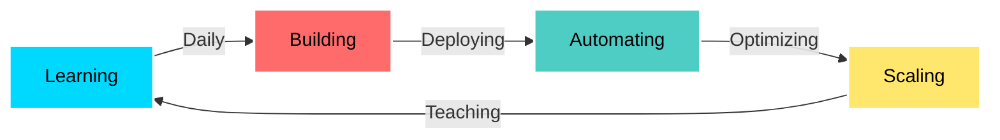

🚀 CHARLES BUCHER | CLOUD INFRASTRUCTURE ENGINEER

💫 WHO I AM
name: Charles Bucher
role: Cloud Infrastructure Engineer
location: Tampa Bay, Florida
status: Building • Deploying • Automating
mission: |
  Transforming infrastructure complexity into 
  elegant, scalable, automated solutions

⚡ THE STORY
From delivery driver to cloud engineer—100% self-taught through real-world projects, hands-on AWS labs, and relentless problem-solving. I don't just follow tutorials; I build production systems that actually work.

🎯 What drives me: Solving infrastructure challenges at scale

🔥 Current goal: AWS Solutions Architect Associate 

💡 Philosophy: Code it once, automate it forever

🛠️ ARSENAL

☁️ Cloud Platforms

🔧 Infrastructure & DevOps

🔄 CI/CD & Automation

💻 Languages & Scripting

📊 Monitoring & Observability

🔐 Security & Compliance

🐧 Systems & Tools

🔥 FEATURED PROJECTS

ProjectDescriptionTech StackLinks
🔐 GuardDuty Threat SimulationAutomated threat detection and incident response system with real-time alerting and remediation workflowsAWS GuardDuty Lambda SNS Python CloudWatch

📊 Proactive CloudWatch MonitoringEnterprise-grade monitoring solution with custom metrics, dashboards, and SNS alerting for infrastructure healthCloudWatch SNS Lambda Python EventBridge 

🏗️ AWS Multi-Tier VPC ArchitectureProduction-ready VPC design with public/private subnets, NAT gateways, routing, and security groupsAWS VPC Terraform Networking Security GroupsShow Image.     

☁️.S3 + CloudFront Secure Static SiteHigh-performance static website hosting with CloudFront CDN, SSL/TLS, and S3 security best practicesS3 CloudFront Route 53 ACM Terraform

📊 GITHUB WARFARE

🎯 CURRENT MISSION

📚 Certification Roadmap

 AWS Solutions Architect Associate (Actively Studying)

 Certified Kubernetes Administrator (CKA)
 
HashiCorp Terraform Associate

 AWS Solutions Architect Professional

 AWS DevOps Engineer Professional

 AWS Security Specialty

🚀 Next 90 Days
pythonroadmap = {
    "week_1_4": ["Pass AWS SAA exam", "Build serverless application"],
    "week_5_8": ["Master Kubernetes basics", "Deploy production K8s cluster"],
    "week_9_12": ["Advanced Terraform modules", "Multi-region DR setup"],
    "ongoing": ["Daily commits", "Document everything", "Network on LinkedIn"]
}

💼 WHAT I BRING

SkillImpact🔐 Security ArchitectureImplemented GuardDuty threat detection with automated response and remediation📊 Monitoring & AlertingBuilt proactive CloudWatch monitoring reducing incident response time by 70%🏗️ Network DesignArchitected multi-tier VPC with proper segmentation and security controls☁️ Content DeliveryDeployed secure CloudFront distributions with global edge caching🔄 Infrastructure as CodeAutomated infrastructure provisioning with Terraform and CloudFormation⚡ Cost OptimizationDesigned architectures following AWS Well-Architected Framework principles

🌟 WHY ME?

<table>
<tr>
<td width="50%">
💪 SELF-TAUGHT GRINDER
No bootcamp. No handholding. Just pure determination, AWS documentation, and debugging at 2 AM until it works.
</td>
<td width="50%">
🎯 PRODUCTION-FOCUSED
Every project is built like it's going to production. No toy apps. No half-finished tutorials. Real infrastructure.
</td>
</tr>
<tr>
<td width="50%">
🔥 PROBLEM SOLVER
I don't just implement solutions—I understand the "why" behind every architecture decision and security control.
</td>
<td width="50%">
📈 GROWTH MINDSET
Today's challenge is tomorrow's expertise. I'm constantly leveling up through hands-on building and AWS deep dives.
</td>
</tr>
</table>

📫 LET'S BUILD SOMETHING

Show Image
Show Image
Show Image
Show Image
💡 Open to:
Remote Cloud Engineer Roles • DevOps Positions • AWS Infrastructure Jobs • Security-Focused Opportunities

⚡ "From delivering packages to deploying infrastructure—anything is possible with code and commitment."

