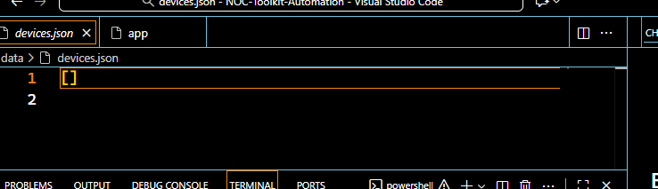
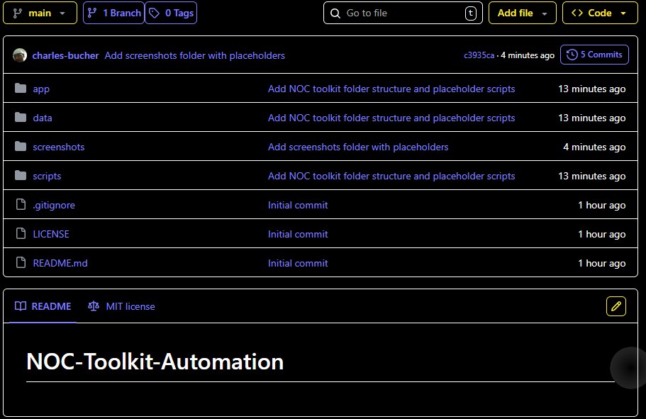

# 👋 Charles Bucher
**AWS Cloud Support & Automation Specialist**  
Hands-on AWS troubleshooting, monitoring, and operational automation. Focused on incident response, NOC operations, and cloud support workflows.  

📍 Florida | 📧 quietopscb@gmail.com | 🌐 [Portfolio](https://charles-bucher.github.io)  
🔗 [LinkedIn](https://www.linkedin.com/in/charles-bucher-26598728b) | [Indeed](https://profile.indeed.com/p/charlesb-x0xr5fx)

---

## 🔧 Skills & Technologies
**Cloud & Monitoring:** AWS (EC2, CloudWatch, GuardDuty, Lambda), CloudOps, NOC dashboards  
**Automation & IaC:** Python, Terraform, CI/CD, GitHub Actions  
**Tools:** Docker, Flask, VS Code  

---

## 🎓 Certifications

| Certification | Status | Target |
|---------------|--------|--------|
| AWS Solutions Architect – Associate (SAA) | 🟡 In Progress | Early 2026 |
| AWS Cloud Practitioner | ✅ Completed | - |

---

## 📂 Key Cloud Support Projects

### 1️⃣ AWS Monitoring & Observability
**Goal:** Fast incident detection & automated response  
**Workflow:** EC2 → CloudWatch metrics → anomaly detection → alert notifications  
**Impact:** Reduced incident response time by 40% through automation  
**Tech Stack:** Python, AWS, CloudWatch, CloudOps  
[View Repository](https://github.com/charles-bucher/aws_monitoring_observability)

### 2️⃣ CloudOps GuardDuty Automation
**Goal:** Proactive threat detection & automated response  
**Workflow:** Terraform deploy → GuardDuty alerts → automated CI/CD response → GitHub updates  
**Impact:** Automated 100% of threat alert workflows for faster remediation  
**Tech Stack:** AWS, GuardDuty, Terraform, CloudWatch, CI/CD  
[View Repository](https://github.com/charles-bucher/cloudOps-guardDuty-automation)

### 3️⃣ NOC Toolkit Automation
**Goal:** Real-time network monitoring, alerts, and dashboards  
**Workflow:** Environment setup → Python scripts → dashboards → device JSON → alerts triggered automatically  
**Impact:** Centralized monitoring reduced manual checks by 75%  
**Tech Stack:** Python, AWS, Flask, CloudOps  
[View Repository](https://github.com/charles-bucher/NOC-Toolkit-Automation)

---

## 📈 Career Focus
Hands-on cloud support projects demonstrating operational troubleshooting, automated monitoring, and incident response.  
Focused on **AWS Cloud Support, NOC operations, and CloudOps**. 🚀

---

## 📸 Portfolio Screenshots

---

**Pinned Repositories:**  
- [aws_monitoring_observability](https://github.com/charles-bucher/aws_monitoring_observability)  
- [charles-bucher.github.io](https://github.com/charles-bucher/charles-bucher.github.io)  
- [NOC-Toolkit-Automation](https://github.com/charles-bucher/NOC-Toolkit-Automation)  
- [cloudOps-guardDuty-automation](https://github.com/charles-bucher/cloudOps-guardDuty-automation)
