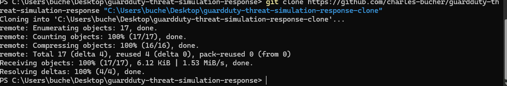
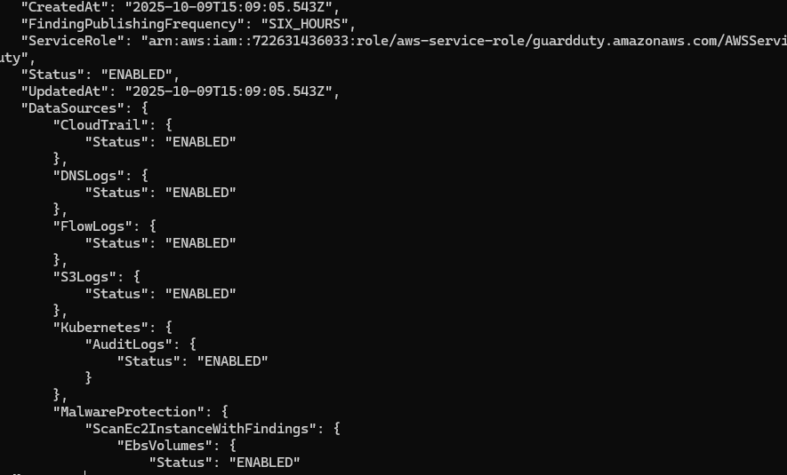

# 👨‍💻 Charles Bucher | Cloud Support & DevOps Engineer

## 🚀 About Me

Cloud Support Engineer specializing in AWS troubleshooting, automation, and DevOps practices. I build hands-on projects that solve real-world cloud operations challenges and demonstrate practical skills for CloudOps, NOC, and Site Reliability Engineering roles.

**Current Focus:** Transitioning into cloud support/DevOps with a focus on automation, monitoring, and incident response.

---

## 📂 Featured Projects

### 1. 🛡️ CloudOps GuardDuty Automation
**Automated threat detection and response using AWS GuardDuty**

*Initial repository setup*

*Infrastructure planning with Terraform*

*Active GuardDuty monitoring*

*Successfully deployed infrastructure*

**Tech Stack:** AWS GuardDuty, Terraform, Python, Lambda  
**Repository:** [CloudOps-GuardDuty-Automation](https://github.com/charles-bucher/cloudOps-guardDuty-automation)

**Key Features:**
- Automated threat detection and alerting
- Infrastructure as Code with Terraform
- Lambda-based automated response
- Real-time security monitoring

---

### 2. 🔍 AWS Monitoring & Observability
**Comprehensive monitoring solution for AWS environments**

*CloudWatch dashboards and alerting*

**Tech Stack:** CloudWatch, SNS, Lambda, Python  
**Repository:** [AWS-Monitoring-Observability](https://github.com/charles-bucher/aws_monitoring_observability)

**Key Features:**
- Custom CloudWatch metrics and dashboards
- Automated alerting via SNS
- Log aggregation and analysis
- Performance monitoring

---

### 3. 🛠️ Cloud Support Troubleshooting Knowledge Base
**Interactive troubleshooting guide for AWS cloud support**

*Step-by-step troubleshooting workflows*

**Tech Stack:** Python, Bash, AWS CLI, Terraform  
**Repository:** [Cloud-Support-Troubleshooting-KB](https://github.com/charles-bucher/Cloud-Support-Troubleshooting-Knowledge-Base)

**Key Features:**
- Common AWS incident scenarios
- Diagnostic automation scripts
- Step-by-step resolution guides
- Terraform modules for issue simulation

---

### 4. 🚨 NOC Toolkit Automation
**Network Operations Center automation and monitoring tools**

*NOC monitoring and automation*

**Tech Stack:** Python, PowerShell, Bash, AWS  
**Repository:** [NOC-Toolkit-Automation](https://github.com/charles-bucher/NOC-Toolkit-Automation)

**Key Features:**
- Automated incident detection
- Health check automation
- Alert management
- Reporting dashboards

---

## 🛠️ Technical Skills

### Cloud Platforms
- **AWS:** EC2, S3, Lambda, CloudWatch, GuardDuty, IAM, VPC, RDS, SNS
- **Infrastructure as Code:** Terraform, CloudFormation

### Programming & Scripting
- **Languages:** Python, Bash, PowerShell
- **Automation:** boto3, AWS CLI, automated remediation

### DevOps & Tools
- **Version Control:** Git, GitHub
- **CI/CD:** GitHub Actions (learning)
- **Monitoring:** CloudWatch, Custom metrics, Log analysis

### Cloud Support & Operations
- AWS troubleshooting and diagnostics
- Incident response and remediation
- Security monitoring and compliance
- Cost optimization and FinOps

---

## 🎯 Current Projects

### 🔄 In Progress
- **Multi-tier VPC Architecture:** Building production-grade VPC with public/private subnets
- **Serverless API:** Lambda + API Gateway + DynamoDB CRUD application
- **CI/CD Pipeline:** Automated testing and deployment with GitHub Actions

### 📚 Learning
- AWS Solutions Architect certification prep
- Advanced Terraform modules and state management
- Container orchestration with ECS
- AWS Security Specialty (next certification)

---

## 📊 GitHub Stats

---

## 🧭 My Learning Path

**Current (2024-2025):**
- ✅ AWS Cloud Practitioner fundamentals
- 🔄 AWS Solutions Architect Associate (studying)
- 🔄 Nightly labs: Terraform, IAM, CloudWatch, Lambda
- 🔄 Building modular GitHub projects for portfolio

**Roadmap:**
1. AWS Solutions Architect Associate
2. AWS SysOps Administrator Associate  
3. AWS Security Specialty
4. AWS DevOps Engineer Professional

**Daily Practice:**
- Hands-on AWS lab environments
- Infrastructure as Code projects
- Automation script development
- Documentation and knowledge sharing

---

## 💼 Professional Background

**Transition to Cloud:**  
Self-taught cloud engineer with 10+ years in logistics and operations. Bringing strong problem-solving, attention to detail, and process optimization skills to cloud support and DevOps roles.

**Why Cloud Support?**
- Passion for troubleshooting and problem-solving
- Love for automation and efficiency
- Interest in helping customers succeed
- Desire to work with cutting-edge technology

---

## 📬 Contact & Links

- **Email:** [quietopscb@gmail.com](mailto:quietopscb@gmail.com)
- **LinkedIn:** [Charles Bucher](https://www.linkedin.com/in/charles-bucher-26598728b)
- **GitHub:** [charles-bucher](https://github.com/charles-bucher)
- **Portfolio:** [charles-bucher.github.io](https://charles-bucher.github.io/)

---

## 🤝 Open to Opportunities

I'm actively seeking:
- **Cloud Support Engineer** roles (AWS)
- **Junior DevOps Engineer** positions
- **NOC/CloudOps** opportunities
- **Remote-friendly** companies

**Ideal Role:** Entry to mid-level position where I can apply my AWS knowledge, automation skills, and troubleshooting abilities while continuing to learn and grow.

---

**💡 Portfolio Philosophy**

> This portfolio showcases hands-on CloudOps, NOC simulations, serverless APIs, automated pipelines, proactive monitoring, and alerting workflows for AWS environments. Every project solves a real problem and demonstrates production-ready skills.

---

### ⭐ If you find my projects helpful, please consider starring them!

**Thanks for visiting!** 🚀

