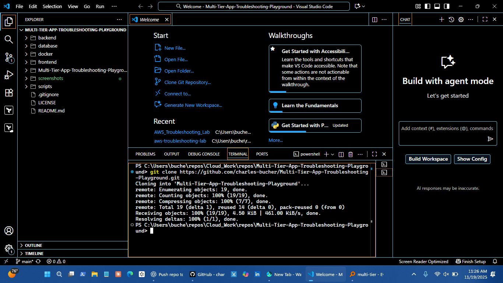
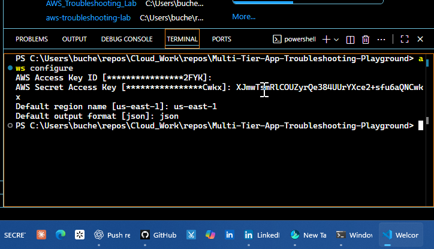
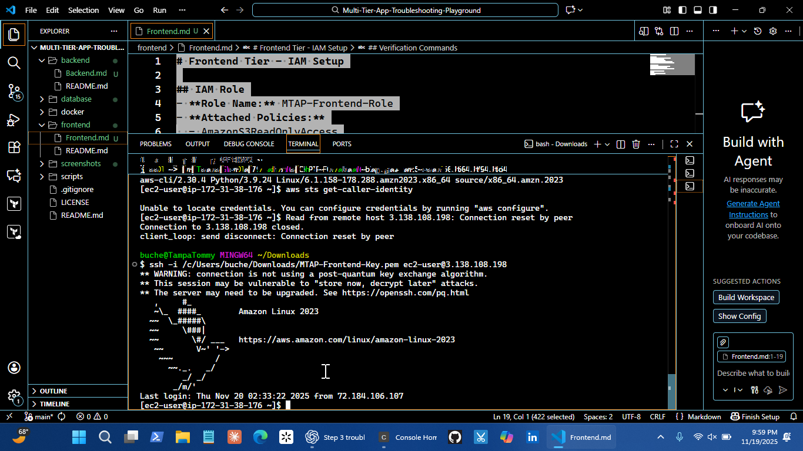
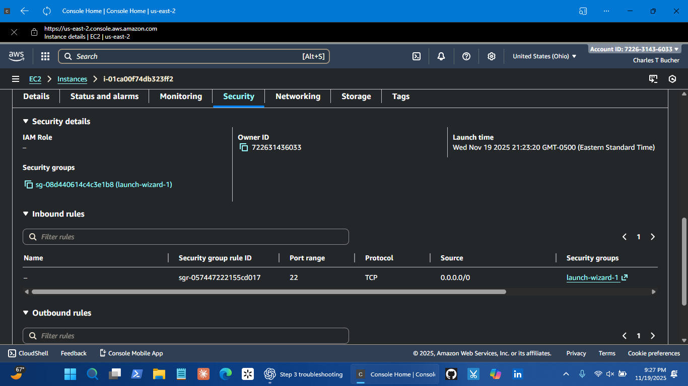
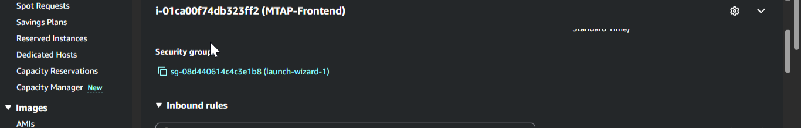
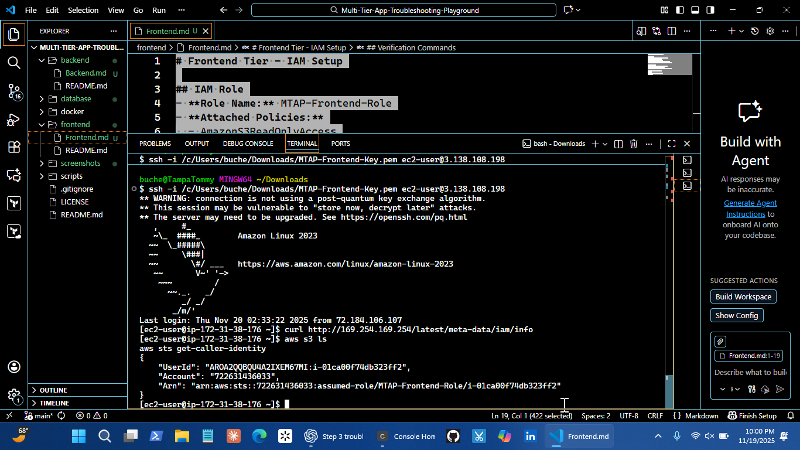
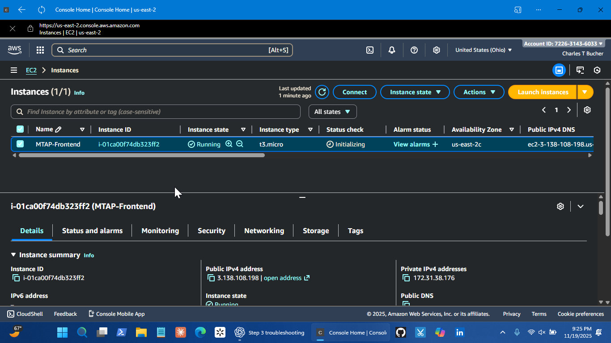
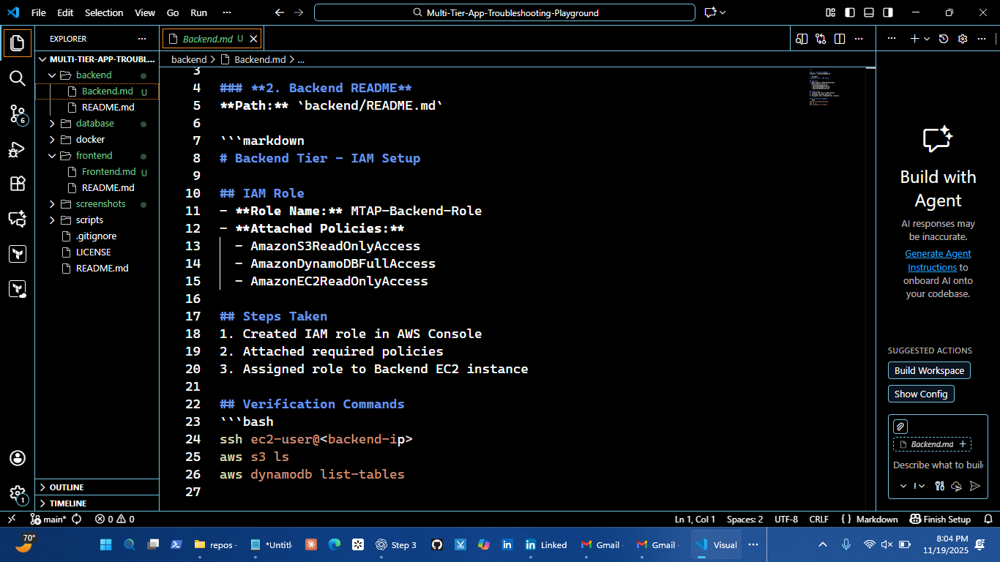
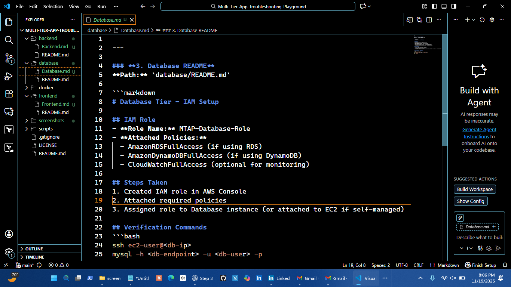

**Step-by-Step Screenshots:**

| Step | Screenshot |
|------|------------|
| 01   |  |
| 02   |  |
| 03   |  |
| 04   |  |
| 05   |  |
| 06   |  |
| 07   |  |
| 08   |  |
| 09   |  |
| 10   |  |
| 14   |  |
| 15   |  |
| 16   |  |
| ...  | *(additional screenshots in folder)* |

---

### 2️⃣ AWS Monitoring & Observability
Automated monitoring pipeline for EC2 metrics, CloudWatch logs, alarms, and incident response. Includes anomaly detection and alert automation using SNS.

**Screenshots:**
| Screenshot | Preview |
|------------|--------|
| Terraform Apply |  |
| Alerts |  |
| CPU Metrics |  |

---

### 3️⃣ CloudOps GuardDuty Automation
Automated threat detection and incident response pipeline using GuardDuty, CloudWatch, and Python Lambda. Simulates real CloudOps/Security workflows.

**Screenshots:**
| Screenshot | Preview |
|------------|--------|
| GuardDuty Findings |  |
| Event Routing |  |
| GitHub Push |  |

---

## ⚡ Skills
AWS EC2, S3, Lambda, CloudWatch, IAM, VPC, Security Groups, Terraform, CloudFormation, Python, Bash, PowerShell, Monitoring, Alerting, Automation, NOC workflows.

---

## 📬 Contact
- GitHub: [https://github.com/charles-bucher](https://github.com/charles-bucher)  
- LinkedIn: [https://www.linkedin.com/in/charles-bucher-cloud](https://www.linkedin.com/in/charles-bucher-cloud)  
- Email: Quietopscb@gmail.com

---

*Portfolio generated automatically. Screenshots are clickable to view full-size.*
