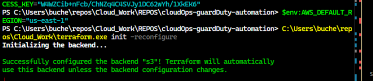
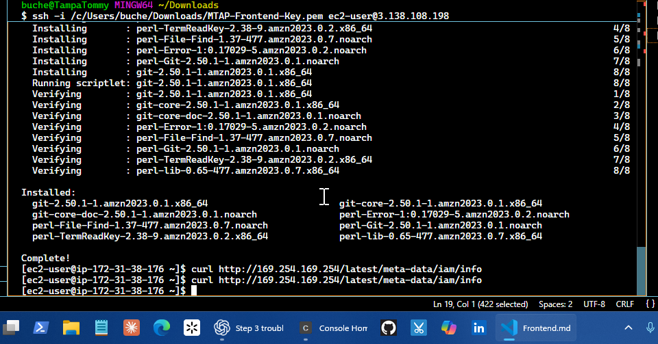
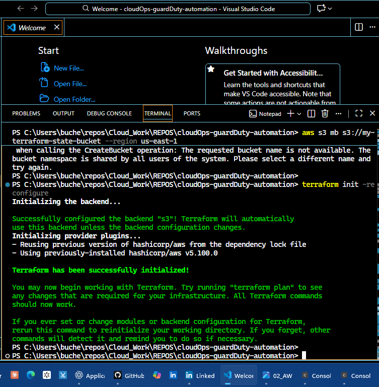

# Charles Bucher – Cloud Support & NOC Portfolio

---

## 👋 About Me
I’m an independent **Cloud Support & NOC Engineer** with hands-on experience building and troubleshooting AWS environments. My work focuses on **CloudOps automation, observability, and incident response** using Python, Terraform, and AWS native tools.

**Portfolio:** [charles-bucher.github.io](https://charles-bucher.github.io)  
**LinkedIn:** [Charles Bucher](https://www.linkedin.com/in/charles-bucher-cloud)  
**Email:** Quietopscb@gmail.com

---

## 🌐 Portfolio Projects

### 1️⃣ AWS Cloud Support Simulation
AWS lab for NOC & Cloud Support practice with EC2, IAM, and Python scripts.

**Screenshots:**

  
  
  
  
  

**Tech:** AWS, EC2, IAM, Python, Bash

---

### 2️⃣ Multi-Tier App Troubleshooting Playground
Lab to deploy multi-tier web applications for troubleshooting, monitoring, and incident response.

**Screenshots:**

  
  
  
  
  

**Tech:** AWS, EC2, VPC, Load Balancer, Terraform, CloudFormation, Python

---

### 3️⃣ AWS Monitoring & Observability
End-to-end monitoring & alerting setup for EC2, CloudWatch, and Lambda.

**Screenshots:**

  
  
  
  

**Tech:** AWS, CloudWatch, Lambda, SNS, Python, EC2, Monitoring, Incident Response

---

### 4️⃣ Terraform & Automation Verification
Screenshots showing infrastructure provisioning and verification via Terraform.

**Screenshots:**

  
  

**Tech:** Terraform, AWS, Automation, CI/CD

---

## 🏗️ Skills & Expertise
- **Cloud Platforms:** AWS (EC2, VPC, S3, IAM, Lambda, CloudWatch, ECS, SNS)  
- **Automation & IaC:** Terraform, CloudFormation, Bash scripting, Git  
- **Programming:** Python  
- **Observability:** Logging, Monitoring, Metrics, Alerting  
- **Operational Support:** Incident response, Troubleshooting, Dashboarding  

---

All screenshots are embedded from this repository’s `/screenshots/` folder for a live portfolio experience.

Hands-on CloudOps & NOC portfolio showcasing:  

- Automated monitoring pipelines using Python, AWS CloudWatch, and Lambda  
- Proactive alerting workflows for operational incident response  
- CI/CD automation for scalable AWS environments  
- Simulations of operational troubleshooting, remediation, and cloud incident resolution

---

**Topics / Keywords:** python, jekyll, github-pages, aws, portfolio, devops, lambda, monitoring, serverless, terraform, logging, s3, cloudwatch, ecs, sns, static-site, cicd, cloud-engineering, cloud-automation, operational-troubleshooting
