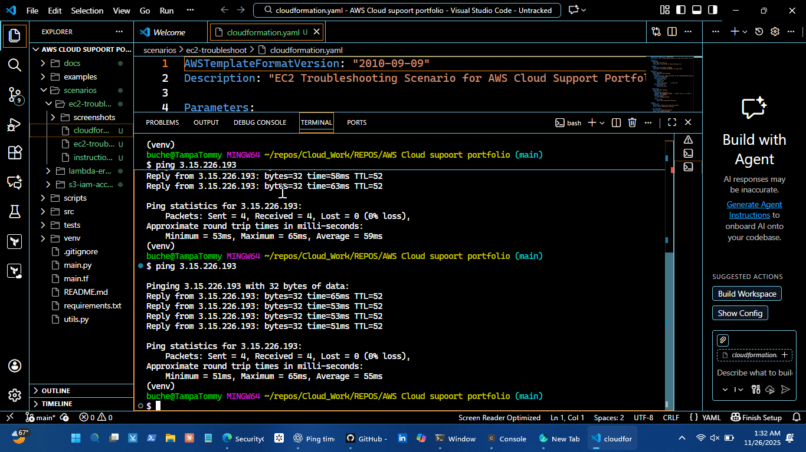
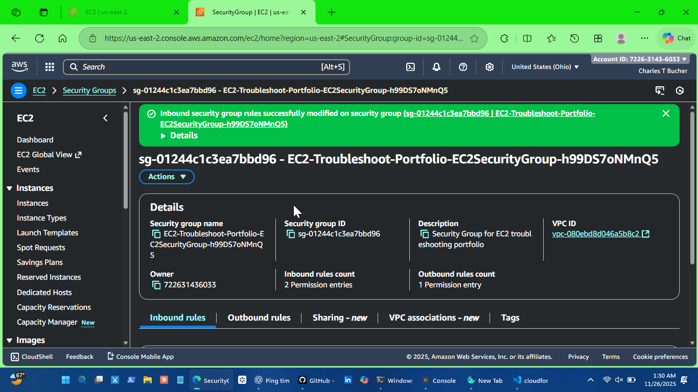
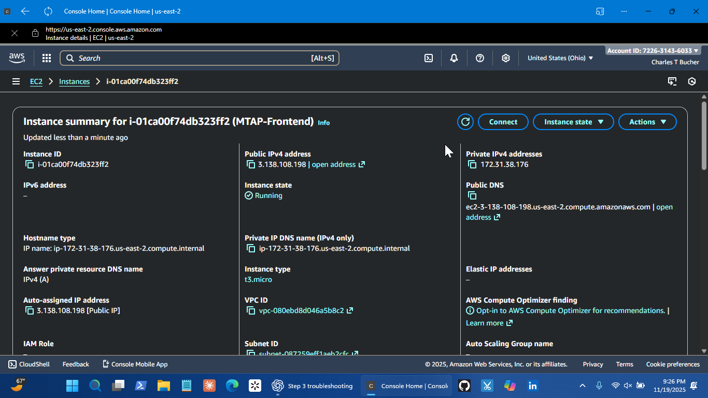
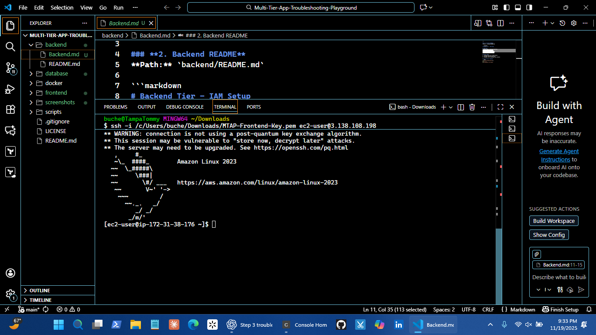
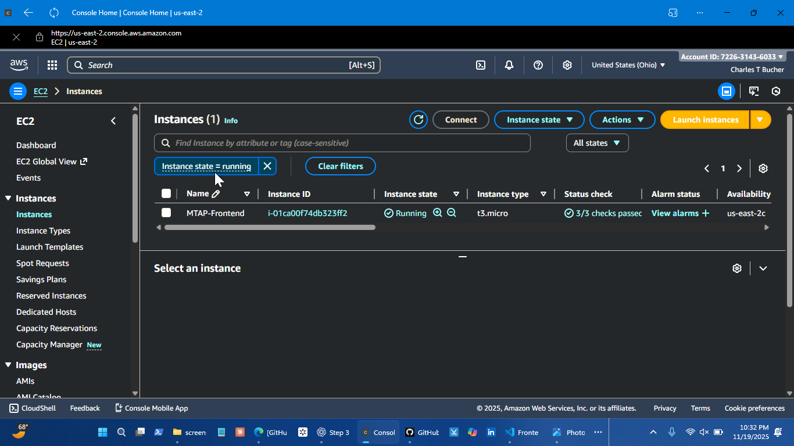
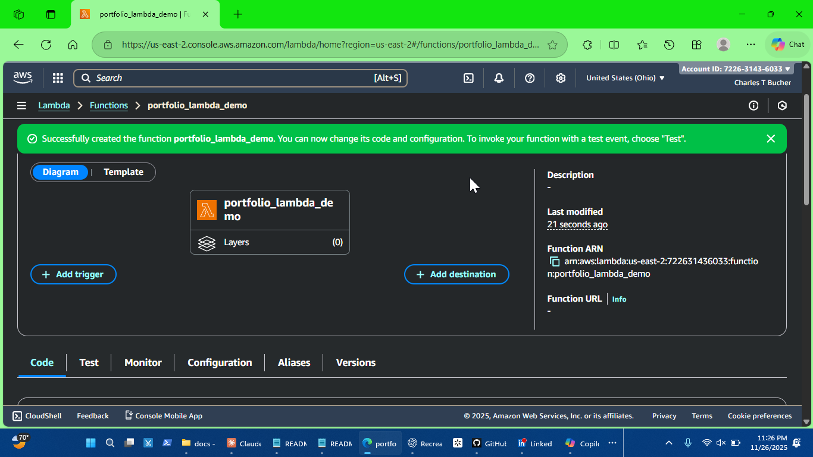

# Charles Bucher | AWS Cloud Support Portfolio

 

**Cloud Support Engineer** | **Remote** | **Pinellas Park, FL**

---

## Summary

Self-taught AWS professional with hands-on cloud support experience through working simulations. Built troubleshooting scenarios covering EC2 connectivity, security groups, CloudFormation, and CloudWatch monitoring. Career transitioner with customer service background seeking entry-level Cloud Support Engineer role.

**Target Roles:** Cloud Support Engineer, AWS Support Associate, Technical Support Engineer

---

## Technical Skills

**AWS Services:** EC2, VPC, S3, CloudFormation, CloudWatch, GuardDuty, Lambda, RDS, ELB, IAM, SNS  
**Troubleshooting:** AWS CLI, CloudWatch Logs, SSH, security group configuration, network connectivity diagnosis, root cause analysis  
**Scripting:** Python (Boto3), Bash, PowerShell  
**Infrastructure as Code:** Terraform, CloudFormation  
**Tools:** Git, GitHub, VS Code, AWS Management Console  

---

## Portfolio Projects

### AWS Cloud Support Simulation
**Repo:** [github.com/charles-bucher/AWS_Cloud_Support_Sim](https://github.com/charles-bucher/AWS_Cloud_Support_Sim)

Simulated customer support tickets with documented resolutions:
- EC2 SSH connectivity failures (security group misconfiguration)
- CloudFormation stack deployment errors (IAM permissions)
- GuardDuty security findings investigation
- S3 bucket access denied troubleshooting

**Technologies:** EC2, VPC, Security Groups, CloudFormation, S3, CloudWatch, Python

---

### Multi-Tier Application Troubleshooting
**Repo:** [github.com/charles-bucher/Multi-Tier-App-Troubleshooting](https://github.com/charles-bucher/Multi-Tier-App-Troubleshooting)

Diagnosed and resolved issues in 3-tier web application:
- Load balancer health check failures
- Database connection timeouts
- API 500 errors
- VPC routing issues

**Technologies:** EC2, RDS, ELB, VPC, CloudWatch Logs, Terraform

---

### CloudWatch Monitoring & Alerting
**Repo:** [github.com/charles-bucher/AWS_Cloudops_Suite](https://github.com/charles-bucher/AWS_Cloudops_Suite)

Built proactive monitoring infrastructure:
- CloudWatch alarms for CPU/memory thresholds
- SNS email/SMS notifications
- Lambda automated responses
- Custom dashboards

**Technologies:** CloudWatch, SNS, Lambda, Python, Terraform

---

## Experience

**Self-Taught AWS Projects** | 2024 - Present
- Built 3 working cloud support simulations with documented troubleshooting workflows
- Created 40+ screenshots demonstrating hands-on AWS implementations
- Wrote 15+ Python automation scripts for common support tasks
- Maintained active GitHub portfolio with regular updates

**Customer Service Background** | 2015 - Present
- Problem-solving under pressure
- Clear communication with technical and non-technical audiences
- Time management and prioritization

---

## Learning Path

**Self-Taught (2024-Present):**
- AWS documentation and Skill Builder courses
- Hands-on labs in personal AWS account
- Built working troubleshooting simulations
- Active GitHub portfolio development

**Certifications (Planned):**
- AWS Certified Cloud Practitioner (Q1 2025)
- AWS Solutions Architect Associate (Q2 2025)

---

## Contact

**Charles Bucher**  
📧 quietopscb@gmail.com  
📍 Pinellas Park, FL (Remote Preferred)  
🔗 [GitHub](https://github.com/charles-bucher) | [LinkedIn](https://linkedin.com/in/charles-bucher)

---

## Portfolio Stats

- **Projects:** 3 AWS troubleshooting simulations
- **Screenshots:** 40+ with documented resolutions
- **Code:** 1000+ lines Terraform, 15+ Python scripts
- **Diagrams:** 16 architecture diagrams
- **Documentation:** Step-by-step troubleshooting guides

---

## Keywords for ATS

AWS, Cloud Support Engineer, Technical Support Engineer, Customer Service, Troubleshooting, Problem Solving, EC2, VPC, S3, CloudWatch, CloudFormation, Security Groups, IAM, Lambda, RDS, ELB, SNS, GuardDuty, Network Connectivity, Log Analysis, Root Cause Analysis, Python, Boto3, Bash, PowerShell, AWS CLI, Remote Work, Help Desk, IT Support, Infrastructure Support, Documentation, Communication Skills, Self-Taught, Entry Level, Junior Support, Technical Documentation, Incident Response, Service Monitoring