# Charles Bucher – Cloud Support & CloudOps Portfolio

---

## Overview

This portfolio highlights hands-on CloudOps, AWS, and NOC skills. It demonstrates:

- Automated monitoring pipelines using Python, AWS CloudWatch, and Lambda  
- Proactive alerting and incident response workflows  
- CI/CD automation for scalable AWS environments  
- Multi-tier application troubleshooting and operational simulations  

**Tech stack & tools:** Python, AWS (EC2, CloudWatch, Lambda, SNS, S3, ECS), Terraform, GitHub Actions, CI/CD, Serverless, Logging & Observability

---

## Portfolio Screenshots

### 1. AWS Cloud Support Simulation (ACSS)

| Screenshot | Description |
|------------|-------------|
|  | EC2 connectivity verification |
| 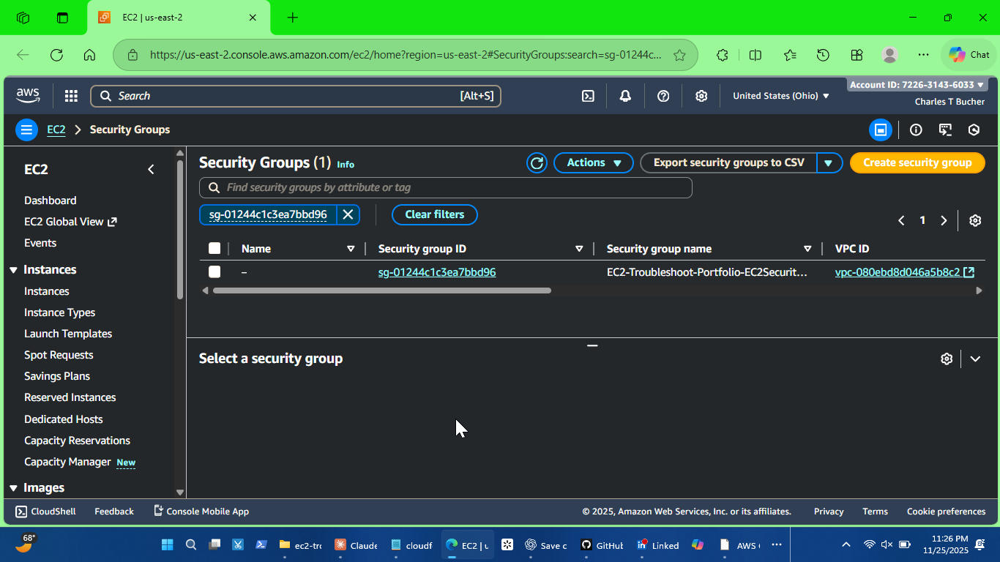 | Security group configured |
|  | Security group verification |
| 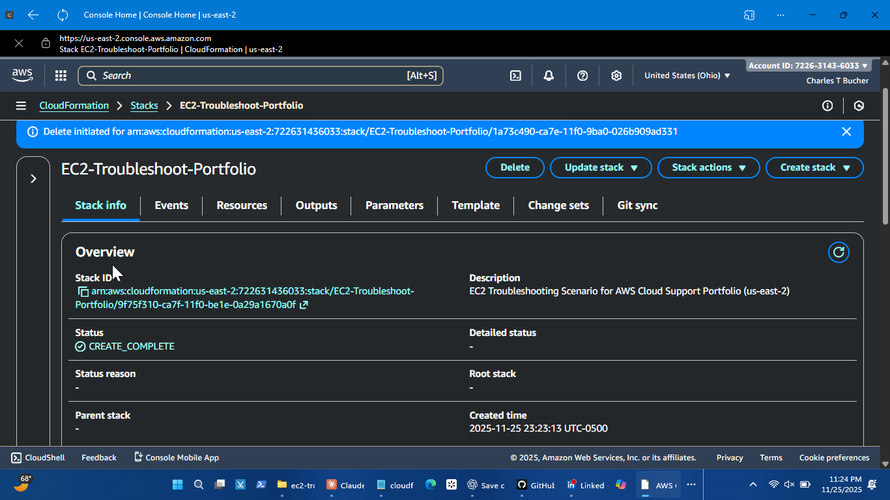 | EC2 stack successfully deployed |
| 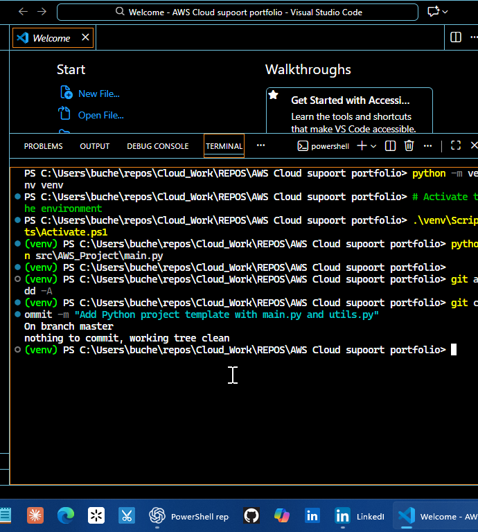 | Python script committed via Git |
| 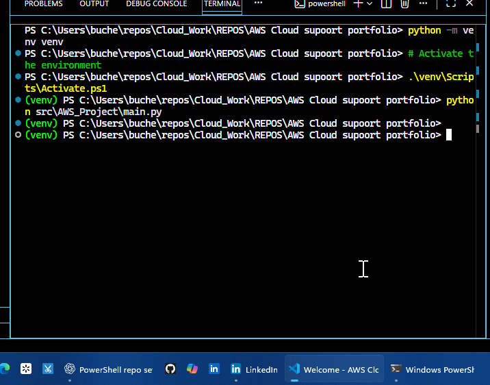 | Python script executed successfully |

[Repo Link](https://github.com/charles-bucher/AWS_Cloud_Support_Sim)

---

### 2. Multi-Tier App Troubleshooting Playground

| Screenshot | Description |
|------------|-------------|
| 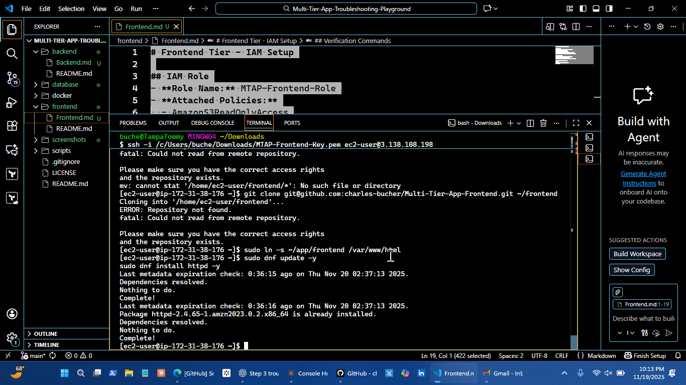 | Multi-tier app dashboard |
| 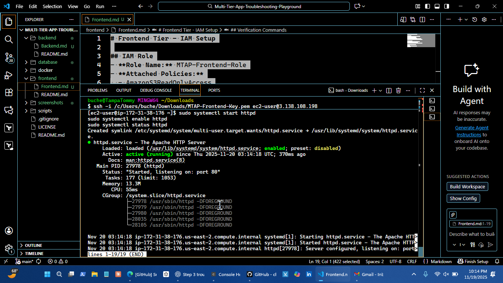 | Error logs from multi-tier app |
| 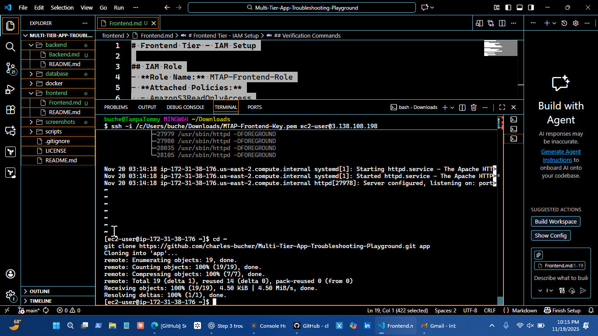 | Architecture diagram |
| 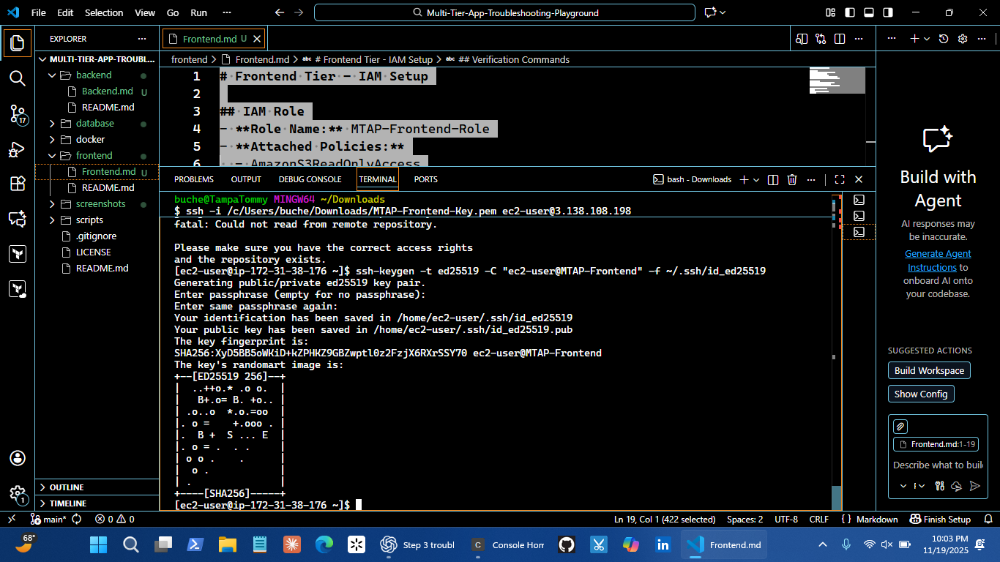 | API response verification |

[Repo Link](https://github.com/charles-bucher/Multi-Tier-App-Troubleshooting-Playground)

---

### 3. AWS Monitoring & Observability

| Screenshot | Description |
|------------|-------------|
|  | Initial AWS setup/configuration |
|  | Cloning the monitoring stack |
|  | Alerts firing correctly |
|  | CPU performance metrics monitoring |
|  | Overview of alarms & notifications |
|  | Central dashboard for observability |
| 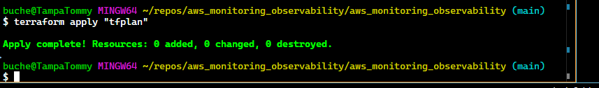 | Example logs for troubleshooting |
|  | Network metrics overview |
|  | Terraform applied updates |
|  | Terraform plan confirmation |
|  | Terraform execution logs |
| 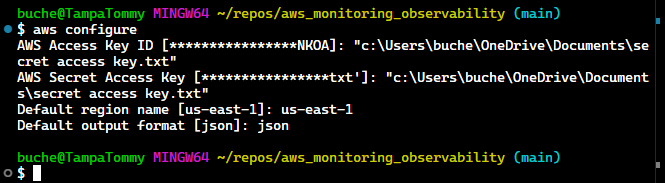 | Terraform post-deployment verification |

[Repo Link](https://github.com/charles-bucher/AWS_Monitoring_Observability)

---

### 4. GuardDuty Labs (Optional/Additional)

| Screenshot | Description |
|------------|-------------|
| 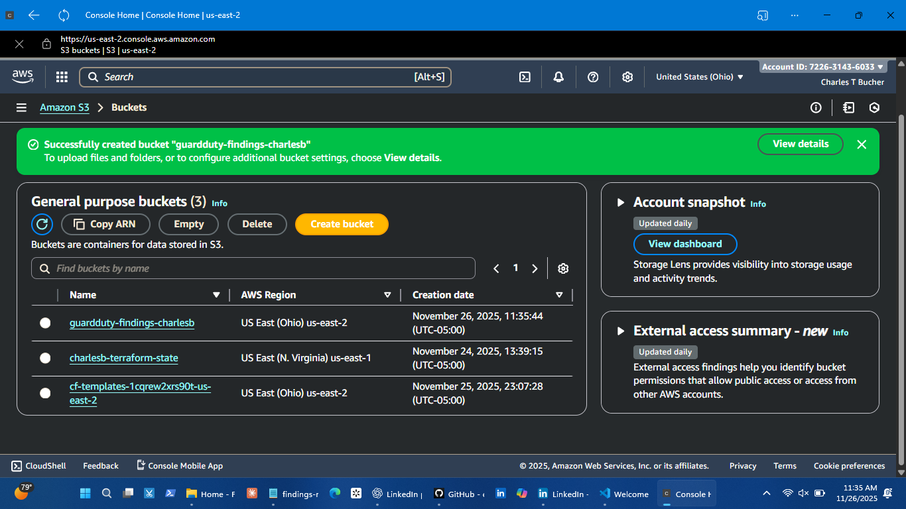 | GuardDuty alert configuration |
|  | GuardDuty console overview |
| 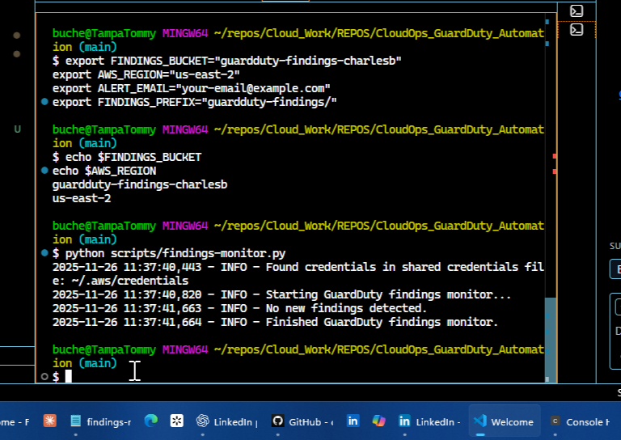 | GuardDuty dashboard view |
| 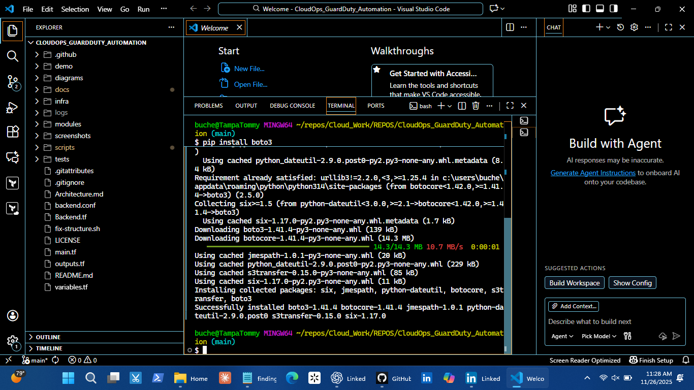 | Findings overview |
| 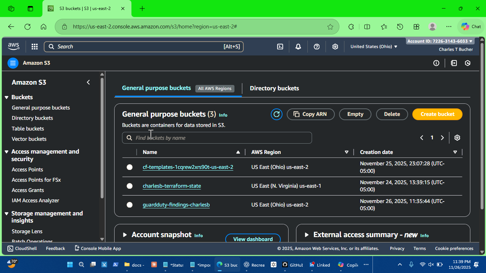 | Threat details |

[Repo Link](https://github.com/charles-bucher/GuardDuty-Labs)

---

## Skills & Expertise

---

## Contact

- GitHub: [charles-bucher](https://github.com/charles-bucher)  
- LinkedIn: [Charles Bucher](https://www.linkedin.com/in/charles-bucher)  
- Email: [Quietopscb@gmail.com](mailto:Quietopscb@gmail.com)

---

**Live Portfolio:** [charles-bucher.github.io](https://charles-bucher.github.io)
