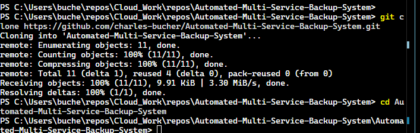
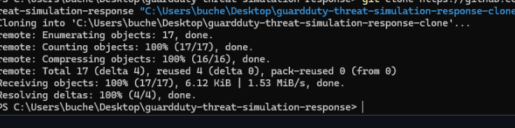
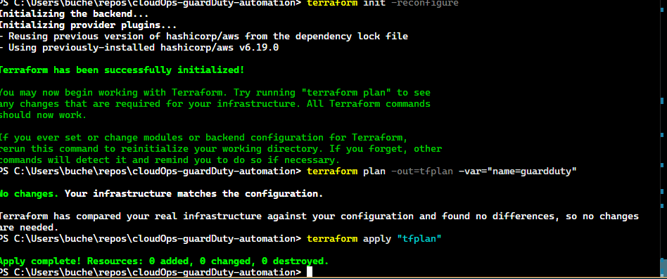

# ⚡ Charles Bucher – Cloud Support & DevOps Portfolio

<!-- Banner -->

---

## 👨‍💻 About Me
**Hands-on AWS CloudOps & NOC engineer**  
Specialized in **multi-tier troubleshooting, monitoring, and automation**. I solve real-world cloud problems, automate workflows, and document everything clearly.  

**Focus Areas:**
- AWS EC2, S3, IAM, VPC, RDS, CloudWatch  
- Python, Bash, PowerShell scripting  
- CI/CD basics: CodePipeline, CloudFormation  
- Security & monitoring: GuardDuty, VPC Flow Logs, ELB metrics  

> ⚡ Building hands-on projects that replicate real-world cloud support challenges.

---

## ⚡ Skills & Badges
  
  
  
  

---

## 🏆 Projects – Level 10

### 1️⃣ Multi-Tier App Troubleshooting Playground
**End-to-end AWS troubleshooting lab** simulating frontend, backend, and database layers.

🔗 [View Project](https://github.com/charles-bucher/Multi-Tier-App-Troubleshooting-Playground)

---

### 2️⃣ AWS Monitoring & Observability
Automates dashboards, anomaly detection, and GuardDuty alerts.

🔗 [View Project](https://github.com/charles-bucher/aws_monitoring_observability)

---

### 3️⃣ CloudOps GuardDuty Automation
Automated threat detection & incident response for AWS.

🔗 [View Project](https://github.com/charles-bucher/cloudOps-guardDuty-automation)

---

## 📈 Achievements & Badges
  

- AWS Cloud Practitioner in progress  
- AWS Solutions Architect Associate coming soon  
- Hands-on labs for troubleshooting, monitoring, and automation  

---

## 📂 Portfolio Structure
📁 Multi-Tier-App-Troubleshooting-Playground
├─ README.md
├─ assets/
│ └─ banner_dark_voltgreen.gif
├─ screenshots/
│ ├─ Multi_01_cloned.png
│ ├─ Multi_02_CLI_configured.png
│ ├─ Multi_03_IAM_Role_Creation_Complete.png
│ ├─ Multi_04_EC2_Instance_List.png
│ ├─ Multi_05_EC2_Instance_Details.png
│ ├─ Multi_06_Security_Group_Rules.png
│ ├─ Multi_07_SSH_Key_Generated.png
│ ├─ Multi_08_-Frontend-Role.png
│ ├─ Multi_09_Ec2_Running.png
│ ├─ Multi_10_Repo_Cloned.png
│ ├─ Multi_14_Apache_Start_Enable.png
│ ├─ Multi_15_Backend_Directory_Structure.png
│ ├─ Multi_16_Database_Directory_Structure.png
│ ├─ Obv_01_clone_success.png
│ ├─ Obv_02_alerts.png
│ ├─ Obv_03_cpu.png
│ ├─ Obv_04_terraform_update.PNG
│ ├─ Obv_05_terraform_confirm.png
│ ├─ Obv_06.png
│ ├─ Obv_07.png
│ ├─ Obv_08.png
│ ├─ Obv_09_.png
│ ├─ Obv_10.png
│ ├─ Obv_11.png
│ ├─ GD_01.png
│ ├─ GD_02.png
│ └─ GD_03.png

yaml
Copy code

---

## 📬 Contact Me
- LinkedIn: [https://www.linkedin.com/in/charles-bucher-cloud/](https://www.linkedin.com/in/charles-bucher-cloud/)  
- GitHub: [https://github.com/charles-bucher](https://github.com/charles-bucher)  
- Email: `Quietopscb@gmail.com`

> ⚡ “Hands-on experience beats theory. I solve problems, build solutions, and automate processes.”
